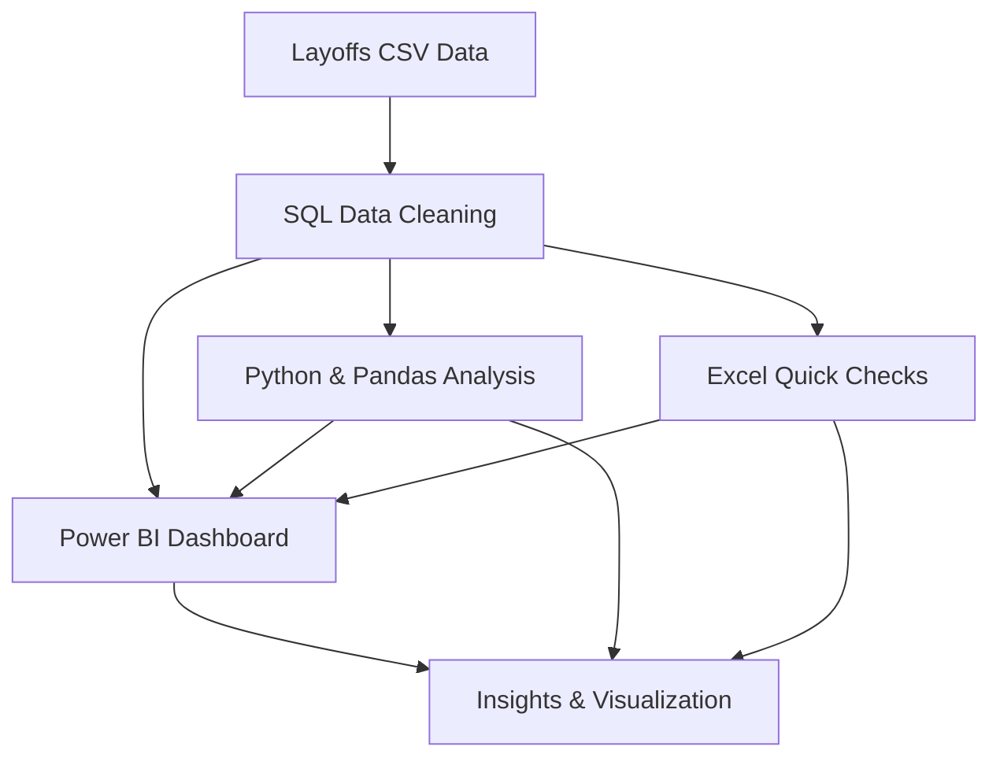

## 🛠️ Tech Stack

<p align="center">
	
	
	
	
	
</p>

---

## 🗂️ System Design




# Tech Layoffs Analysis

## 🌟 Introduction


Welcome to the Tech Layoffs Analysis project—a comprehensive exploration of workforce changes in the tech and startup world. This project goes beyond simple statistics, using a robust tech stack (MySQL, Power BI, Excel, Python, and Pandas) to turn raw layoff data into meaningful business intelligence.

Here, you'll discover how data cleaning, transformation, and visualization can reveal the underlying causes and effects of layoffs. Each step—from wrangling messy CSVs to building interactive dashboards—has been carefully designed to highlight not just trends, but the real-world impact on companies, industries, and economies.

Whether you're a data enthusiast, business leader, or analyst, this repository offers a practical guide to uncovering actionable insights. Dive in to see how industry-standard tools and hands-on analytics can transform complex datasets into compelling stories about the tech sector's evolution.

## 🔎 What Makes This Unique?

- Real-life tech stack: All tools used are industry standards for data analysis and visualization.
- Hands-on data cleaning: No shortcuts—every step is manual, ensuring accuracy and transparency.
- Business context: Insights are tied to real-world events and trends, not just numbers.
- Interactive dashboard: Power BI enables dynamic exploration of the data.

## 🧹 Data Cleaning & Transformation

- SQL scripts handle duplicates, missing values, and inconsistent formatting
- Standardizes industry and country fields
- Converts dates and corrects data types
- Staging tables used for stepwise data refinement


## 📝 SQL Code Examples

Below are some key SQL snippets used for data cleaning and transformation in this project:

```sql
-- Remove duplicates
DELETE FROM layoffs_staging
WHERE id NOT IN (
	SELECT MIN(id)
	FROM layoffs_staging
	GROUP BY company, date, industry
);

-- Handle missing values
UPDATE layoffs_staging
SET country = 'Unknown'
WHERE country IS NULL;

-- Standardize industry names
UPDATE layoffs_staging
SET industry = 'Information Technology'
WHERE industry IN ('IT', 'Tech', 'Technology');
```

These queries are part of the cleaning_eda.sql file and demonstrate the manual, step-by-step approach to preparing the dataset for analysis.


## 📁 Files

- `layoffs.csv` — Raw dataset
- `cleaning_eda.sql` — Data cleaning and transformation steps
- `power_bi_layoffs.pbix` — Power BI dashboard for layoff analysis

## 🛠️ Tech Stack

- MySQL
- Power BI Desktop
- Excel


## 💡 Why This Project?

Manual data preparation and visualization help reveal real-world business and economic trends. This project demonstrates how careful cleaning and analysis can turn messy data into actionable insights.
