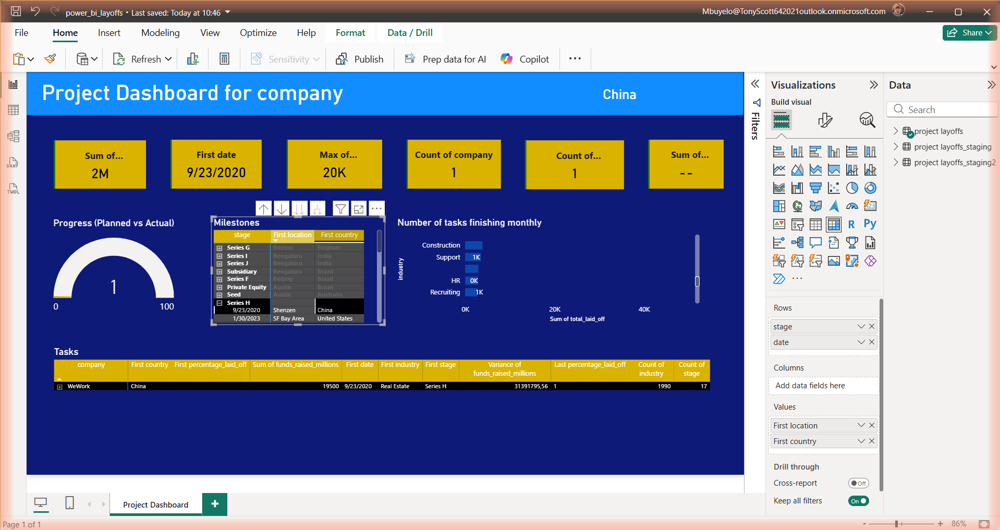
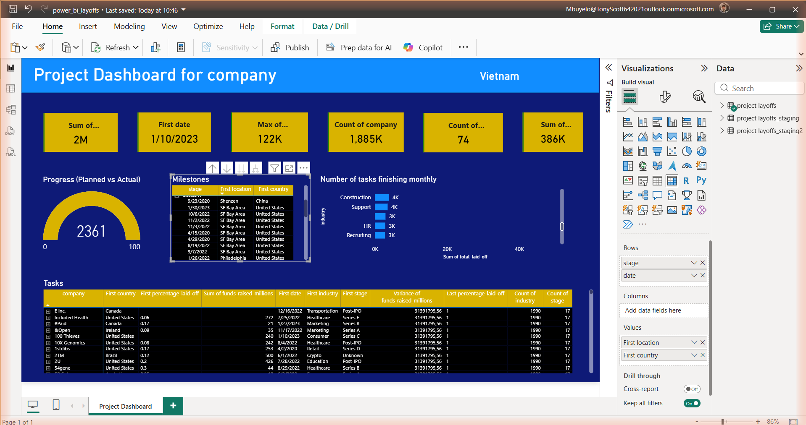
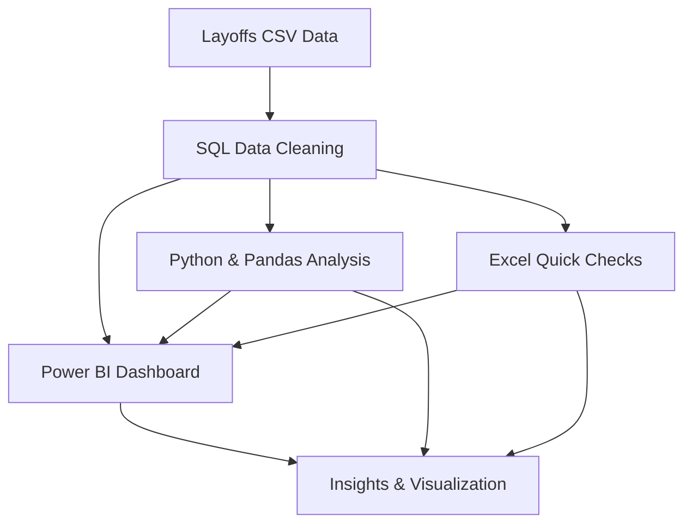

<p align="center">
	
	
	
</p>

---

## 🖼️ Screenshots

### Power BI Project Dashboard Screenshot


This screenshot shows the Power BI report titled "power_bi_layoffs," which provides a comprehensive dashboard visualizing company layoffs across regions and sectors. It includes:
- Total layoffs (2M), max layoffs per event (3K), and total companies affected (101)
- Timeline of key milestones and task completions
- Regional breakdowns (e.g., SF Bay Area, Bengaluru, Philadelphia)
- Sector insights (Healthcare, Finance, Retail, etc.)
- Funding rounds and company-specific data (e.g., Series E, Alto Pharmacy, Aqua Security)
The dashboard integrates staging datasets and visualizations to track planned vs. actual progress, making it a valuable tool for analyzing workforce trends and strategic planning.

### Additional Dashboard View


This image provides another perspective of the Power BI analysis, highlighting further breakdowns or visualizations relevant to the layoff data and trends.

### New Screenshots



These images further illustrate the Power BI analysis and insights.

---


## 🛠️ Tech Stack

<p align="center">
	
	
	
</p>

---

## 🗂️ System Design




# Global & South African Tech Layoffs Analysis

This project provides a professional, data-driven investigation into the global wave of technology sector layoffs, with a special focus on South Africa. Leveraging advanced SQL, Power BI, Excel, and SQL Management Studio, the analysis covers over 3,000 layoff events from 2020–2023, spanning more than 1,000 companies and 40+ countries.

Key objectives include:
- Identifying major layoff trends across global tech and startup ecosystems
- Highlighting the impact on South African companies and workforce
- Uncovering correlations between industry, funding stage, and layoff frequency
- Delivering actionable insights through rigorous data cleaning, transformation, and visualization

All data preparation, analysis, and reporting were conducted by the sole contributor, Mbuyelo Mich.


## 🔎 Project Highlights

- In-depth analysis of layoff data across tech and startup sectors
- Step-by-step data cleaning and transformation

- SQL scripts handle duplicates, missing values, and inconsistent formatting
- Standardizes industry and country fields
- Converts dates and corrects data types
- Staging tables used for stepwise data refinement


## 📝 SQL Code Examples

Below are some key SQL snippets used for data cleaning and transformation in this project:

```sql
-- Remove duplicates
DELETE FROM layoffs_staging
WHERE id NOT IN (
	SELECT MIN(id)
	FROM layoffs_staging
	GROUP BY company, date, industry
);

-- Handle missing values
UPDATE layoffs_staging
SET country = 'Unknown'
WHERE country IS NULL;

-- Standardize industry names
UPDATE layoffs_staging
SET industry = 'Information Technology'
WHERE industry IN ('IT', 'Tech', 'Technology');
```

These queries are part of the cleaning_eda.sql file and demonstrate the manual, step-by-step approach to preparing the dataset for analysis.


## 📁 Files

- `layoffs.csv` — Raw dataset
- `cleaning_eda.sql` — Data cleaning and transformation steps
- `power_bi_layoffs.pbix` — Power BI dashboard for layoff analysis

## 🛠️ Tech Stack

- MySQL
- Power BI Desktop
- Excel


## Contributors

- Mbuyelo Mich

## 💡 Why This Project?

Manual data preparation and visualization help reveal real-world business and economic trends. This project demonstrates how careful cleaning and analysis can turn messy data into actionable insights.
